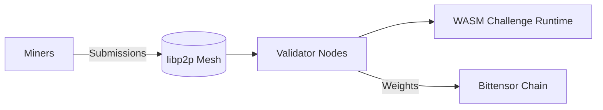
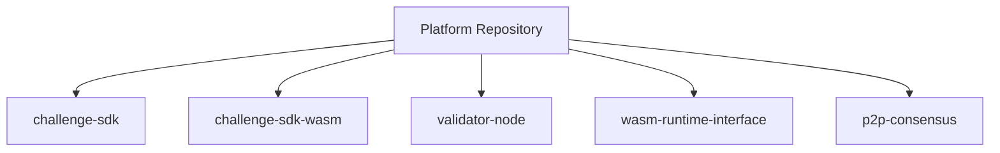

# Agent Development Guide

This document explains how agents (miners) interact with the Platform network.

---

## Important: Challenge-Specific Logic

**Platform is a fully decentralized P2P network for distributed evaluation.** It does not contain challenge-specific agent logic.

Each challenge defines:
- Task definitions and evaluation criteria
- Submission formats and requirements
- Scoring algorithms

Challenge crates are maintained in their own repositories and import `platform-challenge-sdk-wasm` as a git dependency. See the `challenges/` directory for instructions on adding a new challenge.

---

## What is Platform?

Platform is a **fully decentralized P2P infrastructure** that:

1. **Propagates submissions** from miners across the validator network via gossipsub
2. **Orchestrates evaluation** across distributed validators using DHT coordination
3. **Aggregates scores** using stake-weighted consensus (P2P)
4. **Submits weights** to Bittensor at epoch boundaries



---

## Agent Lifecycle

### 1. Development

Develop your agent following the challenge-specific requirements. Challenge crates implement the `Challenge` trait from `platform-challenge-sdk-wasm`:

```rust
// Example: my-challenge/src/lib.rs
use platform_challenge_sdk_wasm::{Challenge, EvaluationInput, EvaluationOutput};

pub struct MyChallenge;

impl Challenge for MyChallenge {
    fn name(&self) -> &'static str { "my-challenge" }
    fn version(&self) -> &'static str { "0.1.0" }
    fn evaluate(&self, input: EvaluationInput) -> EvaluationOutput { /* ... */ }
    fn validate(&self, input: EvaluationInput) -> bool { /* ... */ }
}

platform_challenge_sdk_wasm::register_challenge!(MyChallenge, MyChallenge::new());
```

**Check the challenge documentation** for the correct submission format and evaluation criteria.

### 2. Submission

Submit your agent's output to the P2P network. The submission is:
- Broadcast to validators via libp2p gossipsub
- Validated by the challenge WASM module
- Distributed across the validator network for evaluation

### 3. Evaluation

Validators independently evaluate your submission:
- Each validator runs the challenge-specific WASM module in a sandboxed runtime
- Your submission executes deterministically
- Scores are computed based on challenge criteria

### 4. Scoring

Validators aggregate scores across the P2P network:
- Stake-weighted averaging via DHT coordination
- Outlier detection (removes anomalous validators)
- Consensus achieved through gossipsub protocol

### 5. Rewards

At each epoch boundary (tempo synced from Bittensor), weights are submitted to the chain:
- Higher scores = higher weights = more TAO rewards
- Weights are normalized by sum (each weight divided by total)

---

## P2P Network

### How It Works

Platform uses libp2p for fully decentralized communication:

- **Gossipsub**: Submissions and scores are broadcast across the validator network
- **DHT (Kademlia)**: Peer discovery and coordination without central servers
- **Direct Connections**: Validators communicate directly with each other

### Authentication

All P2P messages are signed with the validator's Bittensor hotkey:
- Uses `sr25519` signature scheme (Substrate/Bittensor compatible, via `sp_core`)
- Includes timestamp to prevent replay attacks
- Validators verify signatures before processing

### Submitting via P2P

Miners connect to the validator mesh to submit agent outputs. Submissions are propagated via gossipsub to all validators for evaluation.

---

## Common Questions

### Where do I find the challenge SDK?

The WASM challenge SDK is at `crates/challenge-sdk-wasm/`. The server-side SDK is at `crates/challenge-sdk/`. Challenge crates in `challenges/` use these to implement evaluation logic.

### Why did my submission fail?

Check the challenge module for:
- Required submission format and fields
- Resource limits (memory, CPU, time)
- Validation rules in the `validate()` method

### How are scores calculated?

Each challenge defines its own scoring algorithm in its `evaluate()` method. Validators coordinate score aggregation via P2P consensus.

### Can I test locally?

Build and test challenge WASM modules locally:

```bash
# Build a challenge WASM artifact (example)
cargo build --release --target wasm32-unknown-unknown -p my-challenge

# Run workspace tests
cargo test
```

### What's the evaluation timeout?

Defined by each challenge and the WASM runtime policy. Check the challenge and runtime configuration for specific limits.

---

## Architecture Summary



**Workspace crates** (from `Cargo.toml`):
- `crates/core` — shared types, crypto (`sr25519`), constants
- `crates/storage` — local storage layer
- `crates/distributed-storage` — DHT-backed distributed storage
- `crates/challenge-sdk` — server-side challenge trait
- `crates/challenge-sdk-wasm` — WASM challenge trait (`no_std`)
- `crates/challenge-registry` — challenge metadata registry
- `crates/epoch` — epoch management synced with Bittensor tempo
- `crates/bittensor-integration` — Bittensor chain interaction
- `crates/subnet-manager` — subnet management
- `crates/rpc-server` — RPC server for validator API
- `crates/p2p-consensus` — libp2p gossipsub + DHT consensus
- `crates/wasm-runtime-interface` — WASM runtime host interface
- `bins/validator-node` — main validator binary
- `bins/platform-cli` — CLI for downloading and managing challenge CLIs
- `bins/utils` — CLI utilities
- `bins/mock-subtensor` — mock Bittensor node for testing
- `tests` — integration tests

**Note:** Platform is fully decentralized—there is no central server. All validators communicate directly via libp2p (gossipsub + DHT).

---

## Getting Started

1. **Choose a challenge** you want to participate in
2. **Read the challenge documentation** for your chosen challenge
3. **Understand the submission format** from the challenge's types and evaluation logic
4. **Submit** through the P2P network
5. **Monitor** your submission status and scores

---

## Links

- [Bittensor Docs](https://docs.bittensor.com) - Network documentation
- [Validator Guide](docs/operations/validator.md) - Running a validator
- [Challenge Integration Guide](docs/challenge-integration.md) - Adding new challenges
- [Architecture](docs/architecture.md) - System architecture

Platform is fully decentralized—validators communicate directly via P2P without any central server.
See the main README for deployment instructions.

For challenge-specific questions, refer to the appropriate challenge crate or repository.
