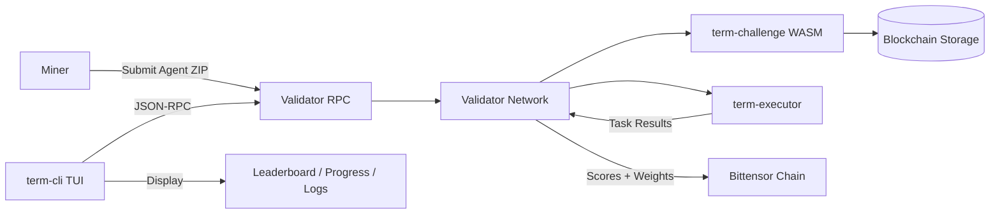
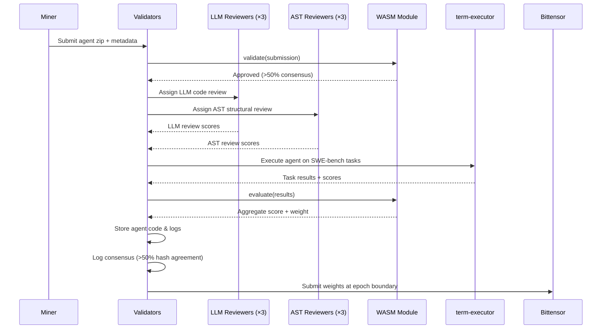
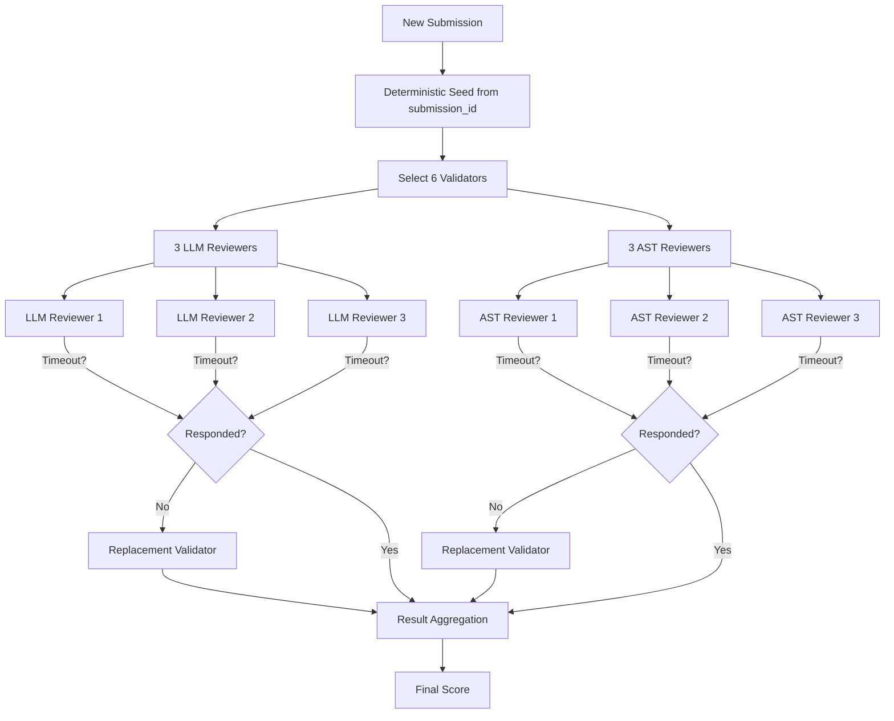
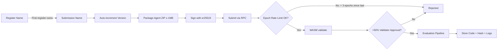
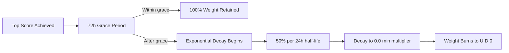
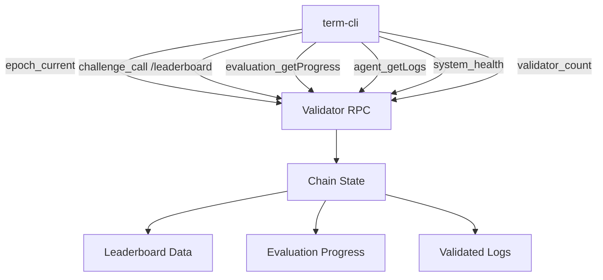
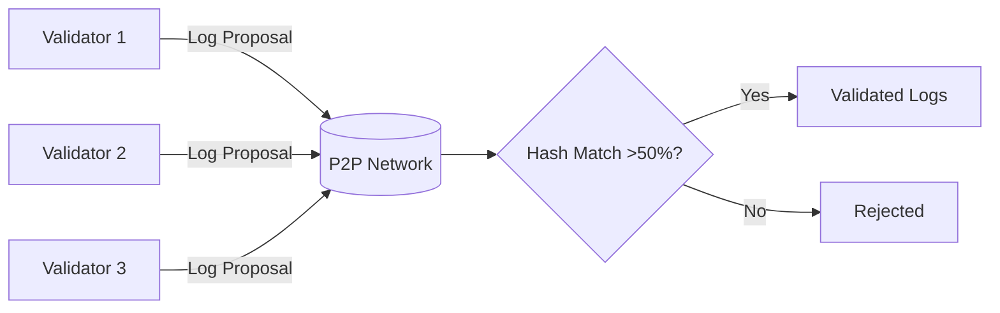
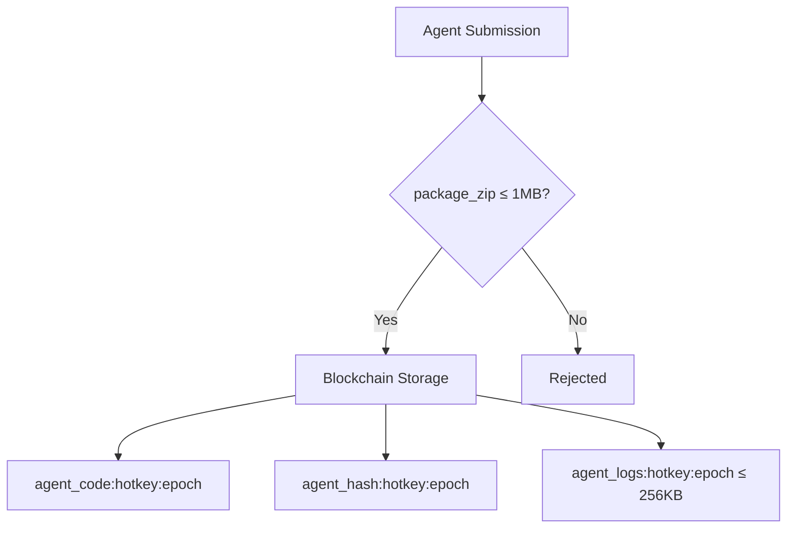

<div align="center">

# τεrm chαllεηgε

**Terminal Benchmark Challenge — WASM Evaluation Module for Platform-v2**

[](https://codecov.io/gh/PlatformNetwork/term-challenge-v2)
[](https://github.com/PlatformNetwork/term-challenge-v2/blob/main/LICENSE)
[](https://www.rust-lang.org/)


</div>

Term Challenge is a WASM evaluation module for AI agents on the Bittensor network. It runs inside [platform-v2](https://github.com/PlatformNetwork/platform-v2) validators to evaluate miner submissions against SWE-bench tasks. Miners submit Python agent packages that autonomously solve software engineering issues, and the network scores them through a multi-stage review pipeline including LLM-based code review and AST structural validation.

---

## System Architecture



---

## Evaluation Pipeline



---

## Validator Assignment



---

## Submission Flow



---

## Decay Mechanism



---

## CLI Data Flow



---

## Agent Log Consensus



---

## Agent Code Storage



---

## Route Architecture

```mermaid
flowchart LR
    Client[Client] -->|JSON-RPC| RPC[RPC Server]
    RPC -->|challenge_call| WE[WASM Executor]
    WE -->|handle_route request| WM[WASM Module]
    WM --> Router{Route Match}
    Router --> LB[/leaderboard]
    Router --> Subs[/submissions]
    Router --> DS[/dataset]
    Router --> Stats[/stats]
    Router --> Agent[/agent/:hotkey/code]
    LB & Subs & DS & Stats & Agent --> Storage[(Storage)]
    Storage --> Response[Serialized Response]
    Response --> WE
    WE --> RPC
    RPC --> Client
```

---

## Features

- **WASM Module**: Compiles to `wasm32-unknown-unknown`, loaded by platform-v2 validators
- **SWE-bench Evaluation**: Tasks selected from HuggingFace CortexLM/swe-bench datasets
- **LLM Code Review**: 3 validators perform LLM-based code review via host functions
- **AST Structural Validation**: 3 validators perform AST-based structural analysis
- **Submission Versioning**: Auto-incrementing versions with full history tracking
- **Timeout Handling**: Unresponsive reviewers are replaced with alternate validators
- **Route Handlers**: WASM-native route handling for leaderboard, submissions, dataset, and agent data
- **Epoch Rate Limiting**: 1 submission per 3 epochs per miner
- **Top Agent Decay**: 72h grace period, 50% daily decay to 0 weight
- **P2P Dataset Consensus**: Validators collectively select 50 evaluation tasks
- **Zip Package Submissions**: Agents submitted as zip packages (no compilation step)
- **Agent Code Storage**: Submitted agent packages (≤ 1MB) stored on-chain with hash verification
- **Log Consensus**: Evaluation logs validated across validators with >50% hash agreement
- **CLI (term-cli)**: Native TUI for monitoring leaderboards, evaluation progress, submissions, and network health

---

## Building

```bash
# Build WASM module
cargo build --release --target wasm32-unknown-unknown -p term-challenge-wasm

# The output .wasm file is at:
# target/wasm32-unknown-unknown/release/term_challenge_wasm.wasm

# Build CLI (native)
cargo build --release -p term-cli
```

---

## Architecture

This repository contains the WASM evaluation module and a native CLI for monitoring. All infrastructure (P2P networking, RPC server, blockchain storage, validator coordination) is provided by [platform-v2](https://github.com/PlatformNetwork/platform-v2).

```
term-challenge/
├── wasm/                   # WASM evaluation module
│   └── src/
│       ├── lib.rs               # Challenge trait implementation (validate + evaluate)
│       ├── types.rs             # Submission, task, config, route, and log types
│       ├── scoring.rs           # Score aggregation, decay, and weight calculation
│       ├── tasks.rs             # Active dataset management and history
│       ├── dataset.rs           # Dataset selection and P2P consensus logic
│       ├── routes.rs            # WASM route definitions for RPC (handle_route)
│       └── agent_storage.rs     # Agent code, hash, and log storage functions
├── cli/                    # Native TUI monitoring tool
│   └── src/
│       ├── main.rs         # Entry point, event loop
│       ├── app.rs          # Application state
│       ├── ui.rs           # Ratatui UI rendering
│       └── rpc.rs          # JSON-RPC 2.0 client
├── docs/
│   ├── architecture.md     # System architecture and internals
│   ├── miner/
│   │   ├── how-to-mine.md  # Complete miner guide
│   │   └── submission.md   # Submission format and review process
│   └── validator/
│       └── setup.md        # Validator setup and operations
├── AGENTS.md               # Development guide
└── README.md
```

---

## How It Works

1. Miners submit zip packages with agent code and SWE-bench task results
2. Platform-v2 validators load this WASM module
3. `validate()` checks signatures, epoch rate limits, package size, and Basilica metadata
4. **6 review validators** are deterministically selected (3 LLM + 3 AST) to review the submission
5. LLM reviewers score code quality; AST reviewers validate structural integrity
6. Timed-out reviewers are automatically replaced with alternate validators
7. `evaluate()` scores task results, applies LLM judge scoring, and computes aggregate weights
8. Agent code and hash are stored on-chain for auditability (≤ 1MB per package)
9. Evaluation logs are proposed and validated via P2P consensus (>50% hash agreement)
10. Scores are aggregated via P2P consensus and submitted to Bittensor at epoch boundaries
11. Top agents enter a decay cycle: 72h grace → 50% daily decay → weight burns to UID 0

---

## CLI Usage

```bash
# Install via platform CLI
platform download term-challenge

# Or build from source
cargo build --release -p term-cli

# Run the TUI
term-cli --rpc-url http://chain.platform.network:9944

# With miner hotkey filter
term-cli --hotkey 5GrwvaEF... --tab leaderboard

# Available tabs: leaderboard, evaluation, submission, network
```

---

## Documentation

- [Architecture Overview](docs/architecture.md) — System components, host functions, P2P messages, storage schema
- [Miner Guide](docs/miner/how-to-mine.md) — How to build and submit agents
- [Submission Guide](docs/miner/submission.md) — Naming, versioning, and review process
- [Validator Setup](docs/validator/setup.md) — Hardware requirements, configuration, and operations

---

## License

Apache-2.0
