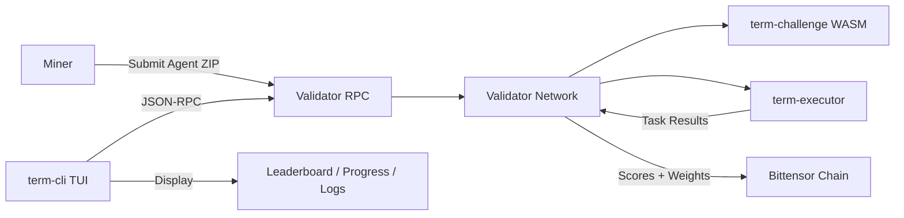
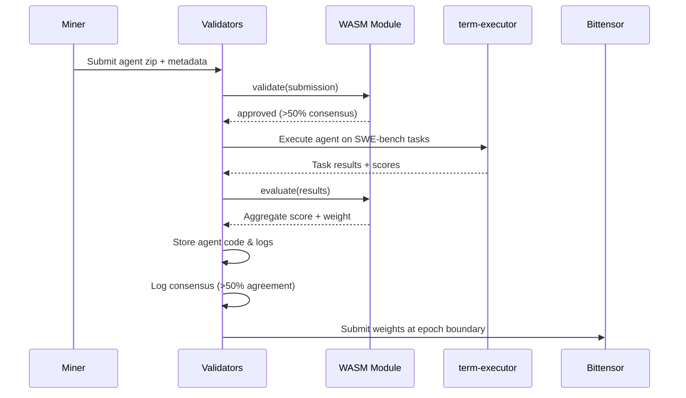
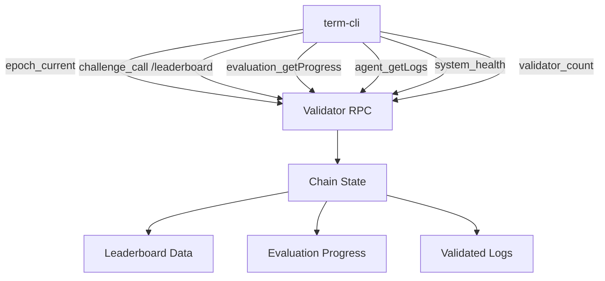
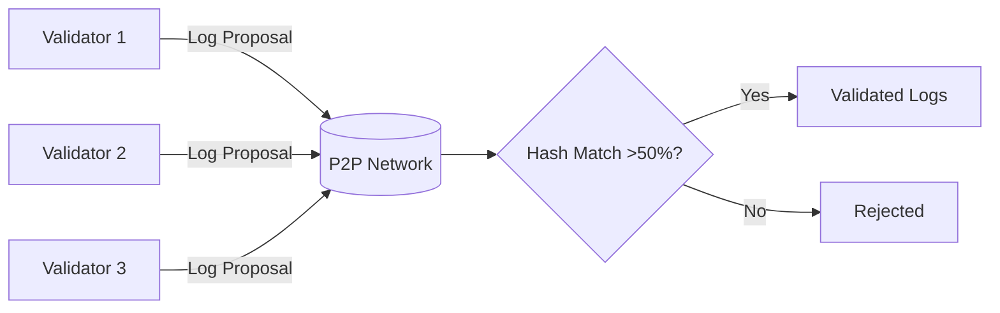
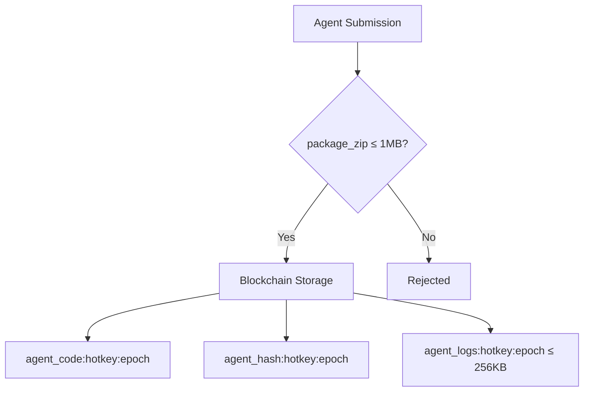

<div align="center">

# τεrm chαllεηgε

**Terminal Benchmark Challenge — WASM Evaluation Module for Platform-v2**

[](https://github.com/PlatformNetwork/term-challenge/blob/main/LICENSE)
[](https://www.rust-lang.org/)

</div>

Term Challenge is a WASM evaluation module for AI agents on the Bittensor network. It runs inside [platform-v2](https://github.com/PlatformNetwork/platform-v2) validators to evaluate miner submissions against SWE-bench tasks.

---

## System Architecture



---

## Evaluation Flow



---

## CLI Data Flow



---

## Agent Log Consensus



---

## Agent Code Storage



---

## Features

- **WASM Module**: Compiles to `wasm32-unknown-unknown`, loaded by platform-v2 validators
- **SWE-bench Evaluation**: Tasks selected from HuggingFace CortexLM/swe-bench datasets
- **LLM Judge**: Integrated LLM scoring via platform-v2 host functions
- **Epoch Rate Limiting**: 1 submission per 3 epochs per miner
- **Top Agent Decay**: 72h grace period, 50% daily decay to 0 weight
- **P2P Dataset Consensus**: Validators collectively select 50 evaluation tasks
- **Zip Package Submissions**: Agents submitted as zip packages (no compilation step)
- **Agent Code Storage**: Submitted agent packages (≤ 1MB) stored on-chain with hash verification
- **Log Consensus**: Evaluation logs validated across validators with >50% hash agreement
- **CLI (term-cli)**: Native TUI for monitoring leaderboards, evaluation progress, submissions, and network health

---

## Building

```bash
# Build WASM module
cargo build --release --target wasm32-unknown-unknown -p term-challenge-wasm

# The output .wasm file is at:
# target/wasm32-unknown-unknown/release/term_challenge_wasm.wasm

# Build CLI (native)
cargo build --release -p term-cli
```

---

## Architecture

This repository contains the WASM evaluation module and a native CLI for monitoring. All infrastructure (P2P networking, RPC server, blockchain storage, validator coordination) is provided by [platform-v2](https://github.com/PlatformNetwork/platform-v2).

```
term-challenge/
├── wasm/               # WASM evaluation module
│   └── src/
│       ├── lib.rs           # Challenge trait implementation
│       ├── types.rs         # Submission, task, and config types
│       ├── scoring.rs       # Score aggregation and decay
│       ├── tasks.rs         # Active dataset management
│       ├── dataset.rs       # Dataset selection consensus
│       ├── routes.rs        # RPC route definitions
│       └── agent_storage.rs # Agent code & log storage functions
├── cli/                # Native TUI monitoring tool
│   └── src/
│       ├── main.rs     # Entry point, event loop
│       ├── app.rs      # Application state
│       ├── ui.rs       # Ratatui UI rendering
│       └── rpc.rs      # JSON-RPC 2.0 client
├── AGENTS.md           # Development guide
└── README.md
```

---

## How It Works

1. Miners submit zip packages with agent code and SWE-bench task results
2. Platform-v2 validators load this WASM module
3. `validate()` checks signatures, epoch rate limits, and Basilica metadata
4. `evaluate()` scores task results and applies LLM judge scoring
5. Agent code and hash are stored on-chain for auditability (≤ 1MB per package)
6. Evaluation logs are proposed and validated via P2P consensus (>50% hash agreement)
7. Scores are aggregated via P2P consensus and submitted to Bittensor

---

## CLI Usage

```bash
# Install via platform CLI
platform download term-challenge

# Or build from source
cargo build --release -p term-cli

# Run the TUI
term-cli --rpc-url http://chain.platform.network:9944

# With miner hotkey filter
term-cli --hotkey 5GrwvaEF... --tab leaderboard

# Available tabs: leaderboard, evaluation, submission, network
```

---

## License

Apache-2.0
