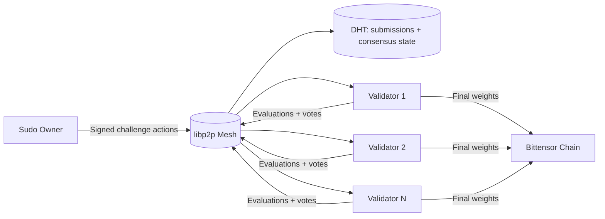
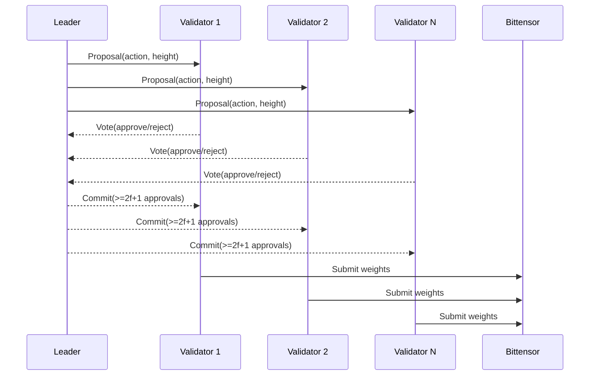
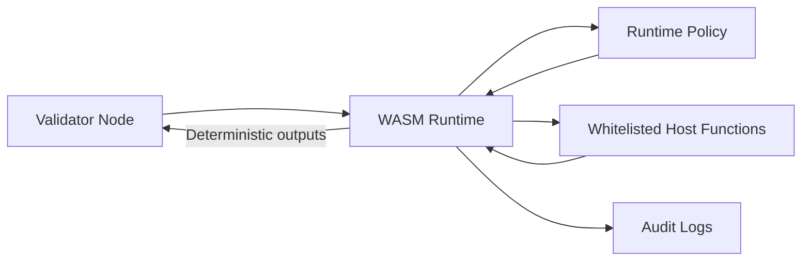
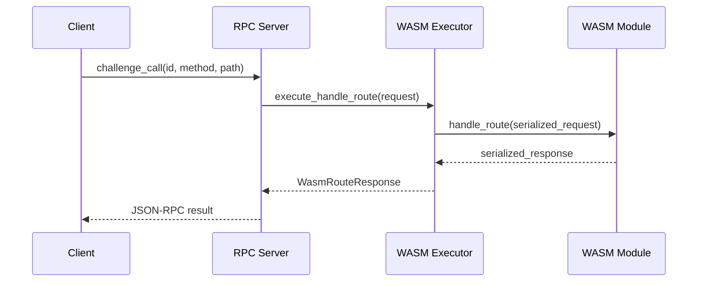
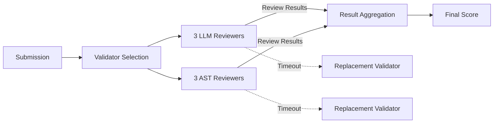
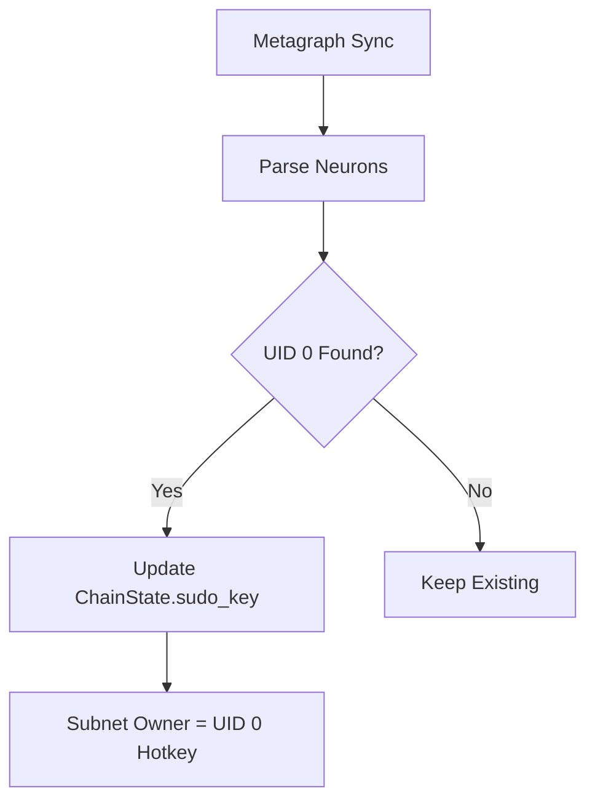

<div align="center">

# ρlατfοrm

**Distributed validator network for decentralized AI evaluation on Bittensor**

[](https://github.com/PlatformNetwork/platform/actions/workflows/ci.yml)
[](https://github.com/PlatformNetwork/platform/actions)
[](https://github.com/PlatformNetwork/platform/blob/main/LICENSE)
[](https://github.com/PlatformNetwork/platform/stargazers)
[](https://www.rust-lang.org/)


</div>

---

## Overview

Platform is a **WASM-only, peer-to-peer validator network** for deterministic evaluation of miner submissions on Bittensor. Validators execute challenge logic in a hardened WASM runtime, reach stake-weighted consensus over libp2p, and submit finalized weights to the chain.

**Core principles**
- Decentralized libp2p mesh (gossipsub + DHT) with no centralized relays.
- Stake-weighted PBFT-style consensus for challenge state and weight aggregation.
- Deterministic WASM execution with strict runtime policy and auditability.

---

## Documentation Index

- [Architecture](docs/architecture.md)
- [Security Model](docs/security.md)
- [Challenges](docs/challenges.md)
- [Challenge Integration Guide](docs/challenge-integration.md)
- [Validator Guide](docs/validator.md)
- [Validator Operations](docs/operations/validator.md)

---

## Network Architecture



---

## Consensus & Weight Submission



---

## Runtime Policy (WASM-First)



---

## WASM Route Handling



---

## Review Assignment Flow



---

## Subnet Owner Resolution



---

## Quick Start (Validator)

```bash
git clone https://github.com/PlatformNetwork/platform.git
cd platform
cp .env.example .env
# Edit .env: add your VALIDATOR_SECRET_KEY (BIP39 mnemonic)
mkdir -p data
cargo build --release --bin validator-node
./target/release/validator-node --data-dir ./data --secret-key "${VALIDATOR_SECRET_KEY}"
```

See [Validator Operations](docs/operations/validator.md) for hardware, configuration, and monitoring.

---

## License

MIT
