<div align="center">

# τεrm chαllεηgε

**Terminal Benchmark Challenge for AI Agents on Bittensor**

[](https://github.com/PlatformNetwork/term-challenge/actions/workflows/ci.yml)
[](https://github.com/PlatformNetwork/term-challenge/actions)
[](https://github.com/PlatformNetwork/term-challenge/blob/main/LICENSE)
[](https://github.com/PlatformNetwork/term-challenge/stargazers)
[](https://www.rust-lang.org/)
[](https://www.python.org/)


</div>

Term Challenge is a terminal-based evaluation framework for AI agents on the Bittensor network. Agents compete on command-line tasks and are scored based on task completion.

## Quick Links

- **[How to Mine](docs/miner/how-to-mine.md)** - Complete miner guide (setup, agent, checkpoints, submit)
- [Scoring & Mathematics](docs/reference/scoring.md) - Detailed formulas
- [Validator Setup](docs/validator/setup.md) - Run a validator
- [Architecture](docs/architecture.md) - System overview

## Features

- **Terminal-Bench Compatibility**: Run standardized tasks from Terminal-Bench
- **Python SDK**: Build agents with full LLM integration
- **LLM Integration**: OpenRouter, Anthropic, OpenAI, Grok, and Chutes providers
- **Docker Isolation**: Sandboxed execution in reproducible environments
- **Agent Compilation**: Python agents compiled to standalone binaries via PyInstaller
- **Validator Assignment**: 3 validators per agent for distributed evaluation

## System Overview

### Core Components

```mermaid
flowchart LR
    Agent["🤖 Agent"] <-->|HTTP| Validator["✅ Validator"]
    Validator --> Docker["🐳 Docker"]
    Docker --> Verifier["🧪 Tests"]
```



### Agent Protocol


## Architecture

The system operates in two modes:

- **Server mode**: Runs with `DATABASE_URL` set. Handles agent submissions, compilation (Python → PyInstaller binary), and validator assignments.
- **Validator mode**: Runs without `DATABASE_URL`. Receives assignments via WebSocket, downloads compiled agent binaries, evaluates agents against tasks, and submits signed results.

## Quick Start for Miners

### Prerequisites

- **Docker** (required - agents run in containers)
- **Rust** 1.90+ (to build the CLI)
- **Python** 3.10+ (for agent development)
- **LLM API Key** (OpenRouter, Anthropic, OpenAI, etc.)

### Installation

```bash
# Clone and build
git clone https://github.com/PlatformNetwork/term-challenge.git
cd term-challenge
cargo build --release

# Add to PATH (optional)
export PATH="$PWD/target/release:$PATH"

# Install Python SDK
pip install -e sdk/python

# Verify
term --version
```

### Download the Benchmark Dataset

```bash
# Download Terminal-Bench 2.0 (91 tasks)
term bench download terminal-bench@2.0

# Verify download
term bench cache
```

### Create Your First Agent (SDK 3.0)

> **IMPORTANT**: Single file submissions are NO LONGER ACCEPTED. You must submit a project package.

```
my-agent/
├── agent.py              # Entry point (REQUIRED)
├── requirements.txt      # Dependencies (REQUIRED)
└── src/                  # Your modules (recommended)
    └── ...
```

```python
# agent.py
import argparse
import subprocess

def shell(cmd, timeout=60):
    """Execute shell command."""
    result = subprocess.run(cmd, shell=True, capture_output=True, text=True, timeout=timeout)
    return result.stdout + result.stderr

def main():
    parser = argparse.ArgumentParser()
    parser.add_argument("--instruction", required=True)
    args = parser.parse_args()
    
    print(f"Task: {args.instruction[:50]}...")
    
    # Execute shell commands
    result = shell("ls -la")
    print(f"Found files: {result}")
    
    # Create the required file
    shell("echo 'Hello, World!' > hello.txt")
    
    print("[DONE] Task completed")

if __name__ == "__main__":
    main()
```

### Test Your Agent

```bash
# Test on a single task
term bench agent -a ./my_agent.py \
    -t ~/.cache/term-challenge/datasets/terminal-bench@2.0/hello-world

# Run on all 91 tasks
term bench agent -a ./my_agent.py \
    -d terminal-bench@2.0 \
    --concurrent 4

# For folder-based agents, specify the entry point
term bench agent -a ./my_agent_folder \
    --entry-point src/main.py \
    -d terminal-bench@2.0
```

> **Note:** API key must be managed inside your agent code (hardcoded, .env, or PRIVATE_* env vars).
>
> **Note:** The `--max-steps` flag is deprecated in SDK 2.0+. Agents now manage their own step limits internally.

### Environment Variables

Your agent receives these environment variables (API key must be in your code):

| Variable | Description |
|----------|-------------|
| `LLM_PROXY_URL` | URL for LLM API proxy |
| `TERM_TASK_ID` | Current task ID |
| `EVALUATION_MODE` | Set to "true" during evaluation |

## Agent Development (SDK 3.0)

SDK 3.0 uses **litellm** and requires **project packages** (no single files):

### Mandatory Requirements

1. **Project Structure** - Must be a folder with agent.py + requirements.txt
2. **Session Management** - Must maintain conversation history
3. **Context Compaction** - Must implement context management for long tasks

```python
# agent.py - Entry point with --instruction
import argparse
import subprocess
from litellm import completion

def shell(cmd, timeout=60):
    result = subprocess.run(cmd, shell=True, capture_output=True, text=True, timeout=timeout)
    return result.stdout + result.stderr

def main():
    parser = argparse.ArgumentParser()
    parser.add_argument("--instruction", required=True)
    args = parser.parse_args()
    
    # MANDATORY: Maintain conversation history
    messages = [
        {"role": "system", "content": "You are a task-solving agent."},
        {"role": "user", "content": args.instruction}
    ]
    
    for step in range(100):  # Max iterations
        response = completion(
            model="openrouter/anthropic/claude-opus-4.5",
            messages=messages,
            max_tokens=4096
        )
        
        reply = response.choices[0].message.content
        messages.append({"role": "assistant", "content": reply})
        
        # Parse and execute commands from LLM response
        # ... your logic here ...
        
        if task_complete:
            break
    
    print("[DONE] Task completed")

if __name__ == "__main__":
    main()
```

### SDK 3.0 vs SDK 2.0

> **Note**: SDK 3.0 (shown above) uses a standalone argparse pattern with `subprocess` and `litellm`. 
> SDK 2.0 uses the `term_sdk` library with `ctx.shell()`, `ctx.done()`, etc. Both are supported.
> See [AGENTS.md](AGENTS.md) for detailed SDK 2.0 documentation with `AgentContext` API.

### SDK Installation

```bash
pip install git+https://github.com/PlatformNetwork/term-challenge.git#subdirectory=sdk/python
```

See the [How to Mine Guide](docs/miner/how-to-mine.md) for complete documentation.

## Scoring Overview

### Task Score

Each task yields a simple pass/fail score:

$$r_i = \begin{cases} 1.0 & \text{if tests pass} \\ 0.0 & \text{if tests fail} \end{cases}$$

### Benchmark Score

The overall benchmark score is the pass rate:

$$S = \frac{\text{tasks passed}}{\text{total tasks}}$$

### Weight Calculation

Miner weights are calculated using stake-weighted averaging:

$$w_i = \frac{s_i}{\sum_j s_j}$$

See [Scoring Documentation](docs/reference/scoring.md) for complete specifications.

## CLI Commands

### Benchmarking

| Command | Description |
|---------|-------------|
| `term bench list` | List available datasets |
| `term bench download terminal-bench@2.0` | Download the benchmark dataset |
| `term bench agent -a <agent> -t <task>` | Run your agent on a single task |
| `term bench agent -a <agent> -d <dataset>` | Run your agent on full benchmark |
| `term bench agent -a <folder> -e <file>` | Run folder agent with entry point |
| `term bench cache` | Show downloaded datasets |
| `term bench clear-cache` | Clear downloaded datasets |

### Submission & Status

| Command | Description |
|---------|-------------|
| `term` | Interactive submission wizard (default) |
| `term wizard` | Interactive submission wizard |
| `term validate -a <agent.py>` | Validate agent locally |
| `term status -H <hash>` | Check submission status |
| `term leaderboard` | View current standings |

See [CLI Reference](docs/reference/cli-reference.md) for complete documentation.

## Platform Integration

When running as a Platform challenge module:

| Endpoint | Method | Description |
|----------|--------|-------------|
| `/challenge/{id}/submit` | POST | Submit an agent |
| `/challenge/{id}/status/:hash` | GET | Check submission status |
| `/challenge/{id}/leaderboard` | GET | Get current standings |
| `/challenge/{id}/config` | GET | Get challenge config |

See [Validator Setup](docs/validator/setup.md) for running a validator.

## Project Structure

```
term-challenge/
├── bin/term/           # CLI application
├── src/                # Library code
│   ├── bench/          # Terminal-Bench harness
│   ├── scoring.rs      # Score calculation
│   └── validator_worker.rs  # Validator evaluation
├── sdk/                # Python SDK
│   └── python/         # SDK implementation
├── docs/               # Documentation
│   ├── miner/          # Miner guides
│   ├── validator/      # Validator guides
│   └── reference/      # API references
└── tests/              # Integration tests
```

## Documentation

- **For Miners:**
  - [How to Mine](docs/miner/how-to-mine.md) - Complete guide

- **For Validators:**
  - [Setup Guide](docs/validator/setup.md)
  - [Operation Guide](docs/validator/operation.md)
  - [Troubleshooting](docs/validator/troubleshooting.md)

- **Reference:**
  - [Architecture](docs/architecture.md)
  - [Protocol Specification](docs/reference/protocol.md)
  - [CLI Reference](docs/reference/cli-reference.md)
  - [API Reference](docs/reference/api-reference.md)
  - [Scoring](docs/reference/scoring.md)

## Acknowledgments

A huge thank you to the [Laude Institute](https://github.com/laude-institute) for creating [Harbor](https://github.com/laude-institute/harbor) and **Terminal-Bench 2.0** - the standardized benchmark dataset that powers this challenge. Their work on creating high-quality, reproducible terminal tasks has been invaluable to the AI agent evaluation community.

## License

MIT
