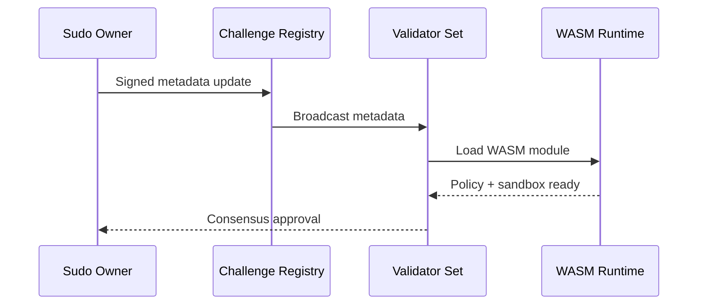

# Platform Challenge Crates

This directory contains challenge crates that integrate with the Platform validator network. Production execution is **WASM-only**.

## Directory Structure

```
challenges/
├── README.md           # This file
├── compiled/           # Built WASM artifacts (generated by build-wasm.sh)
└── [your-challenge]/   # Your custom challenge crate
```

## Challenge Lifecycle



## Adding a New Challenge Crate

1. Create your challenge crate in this directory or reference it as a git dependency.
2. Implement the `Challenge` trait from `platform-challenge-sdk-wasm` (WASM) or the `ServerChallenge` trait from `platform-challenge-sdk` (server-side).
3. Register your challenge metadata via the challenge registry flow.
4. Update the workspace `Cargo.toml` if adding locally.

## Challenge Crate Requirements

### WASM Challenges (Recommended)

- Must implement `platform-challenge-sdk-wasm::Challenge` trait.
- Must use `register_challenge!` macro to export the required WASM ABI functions.
- Must produce deterministic results for consensus.
- WASM module exports: `evaluate(ptr, len) -> i64`, `validate(ptr, len) -> i32`, `alloc(size) -> i32`.
- Input/output serialized with `bincode` across the WASM boundary using `EvaluationInput` / `EvaluationOutput`.

### Server Challenges (Legacy)

- Must implement `platform-challenge-sdk::ServerChallenge`.
- Must provide `/evaluate` HTTP endpoint.
- Must handle graceful shutdown signals.
- Must support state persistence for hot-reload.
- Must produce deterministic results for consensus.

## Build WASM Artifacts

```bash
# Build a specific challenge crate
./scripts/build-wasm.sh <crate-name>

# Build all challenge crates (discovers crates under challenges/*/)
./scripts/build-wasm.sh
```

The build script will:
- Compile the crate for `wasm32-unknown-unknown`
- Strip debug info with `wasm-strip` (if available)
- Optimize with `wasm-opt` (if available)
- Copy the artifact to `challenges/compiled/`
- Print the SHA256 hash for registry verification

## Test Harness (Docker Optional)

Docker is optional and used only for integration testing. Use the comprehensive test harness if you need Docker-backed evaluations:

```bash
./scripts/test-comprehensive.sh
```

## External Challenge Crates

Challenge crates can also live in external repositories. They should:

- Import `platform-challenge-sdk-wasm` as a dependency for WASM challenges.
- Implement the `Challenge` trait and use `register_challenge!` macro.
- Publish a WASM artifact for production use.
- Optionally include Docker config for local/CI tests only.

## Documentation

- [Challenge Integration Guide](../docs/challenge-integration.md)
- [Challenges](../docs/challenges.md)
- [Architecture](../docs/architecture.md)
