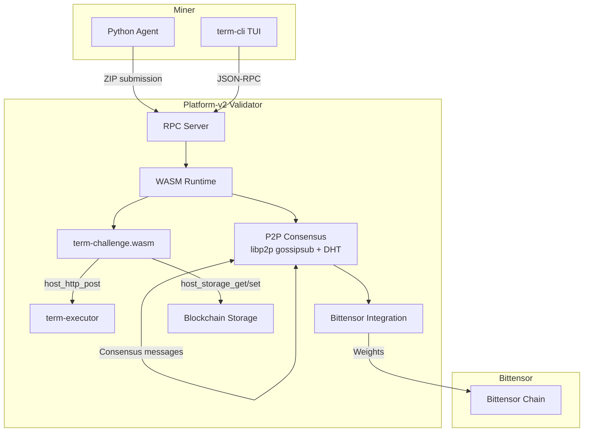
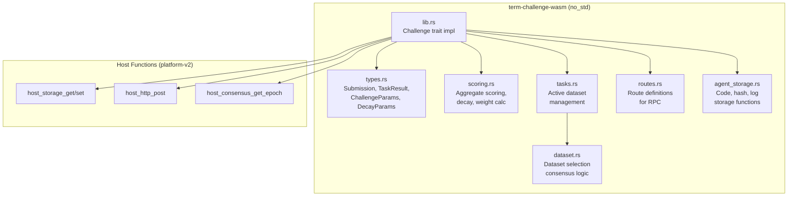

# Architecture Overview

This document describes the internal architecture of Term Challenge, including system components, the WASM module design, host function surface, P2P message types, and storage schema.

---

## System Components



---

## WASM Module Architecture



### Module Responsibilities

| Module | Purpose |
| --- | --- |
| `lib.rs` | Implements the `Challenge` trait: `validate()`, `evaluate()`, `tasks()`, `configure()` |
| `types.rs` | All data structures: `Submission`, `TaskResult`, `ChallengeParams`, `DecayParams`, `AgentLogs`, `RouteDefinition` |
| `scoring.rs` | Score aggregation by difficulty, pass rate calculation, decay application, weight conversion |
| `tasks.rs` | Active dataset storage/retrieval, dataset history management |
| `dataset.rs` | P2P dataset consensus logic (reserved for future implementation) |
| `routes.rs` | Route definitions for challenge RPC endpoints |
| `agent_storage.rs` | Agent code, hash, and log storage with size limits |

---

## Host Function Surface

These are the host functions available to WASM challenge modules, provided by `platform-challenge-sdk-wasm`. Term Challenge uses a subset of these.

### Network Functions (`platform_network`)

| Function | Signature | Description | Used by Term Challenge |
| --- | --- | --- | --- |
| `host_http_get` | `(request: &[u8]) → Result<Vec<u8>, i32>` | HTTP GET request | No |
| `host_http_post` | `(request: &[u8], body: &[u8]) → Result<Vec<u8>, i32>` | HTTP POST request | Yes (LLM judge) |
| `host_dns_resolve` | `(request: &[u8]) → Result<Vec<u8>, i32>` | DNS resolution | No |

### Storage Functions (`platform_storage`)

| Function | Signature | Description | Used by Term Challenge |
| --- | --- | --- | --- |
| `host_storage_get` | `(key: &[u8]) → Result<Vec<u8>, i32>` | Read from blockchain storage | Yes |
| `host_storage_set` | `(key: &[u8], value: &[u8]) → Result<(), i32>` | Write to blockchain storage | Yes |

### Terminal Functions (`platform_terminal`)

| Function | Signature | Description | Used by Term Challenge |
| --- | --- | --- | --- |
| `host_terminal_exec` | `(request: &[u8]) → Result<Vec<u8>, i32>` | Execute terminal command | No |
| `host_read_file` | `(path: &[u8]) → Result<Vec<u8>, i32>` | Read file contents | No |
| `host_write_file` | `(path: &[u8], data: &[u8]) → Result<(), i32>` | Write file contents | No |
| `host_list_dir` | `(path: &[u8]) → Result<Vec<u8>, i32>` | List directory contents | No |
| `host_get_time` | `() → i64` | Get current timestamp | No |
| `host_random_seed` | `(buf: &mut [u8]) → Result<(), i32>` | Fill buffer with random bytes | No |

### Sandbox Functions (`platform_sandbox`)

| Function | Signature | Description | Used by Term Challenge |
| --- | --- | --- | --- |
| `host_sandbox_exec` | `(request: &[u8]) → Result<Vec<u8>, i32>` | Execute in sandbox | No |
| `host_get_timestamp` | `() → i64` | Get sandbox timestamp | No |
| `host_log` | `(level: u8, msg: &str) → ()` | Log a message | No |

### LLM Functions (`platform_llm`)

| Function | Signature | Description | Used by Term Challenge |
| --- | --- | --- | --- |
| `host_llm_chat_completion` | `(request: &[u8]) → Result<Vec<u8>, i32>` | LLM chat completion | No (uses HTTP post instead) |
| `host_llm_is_available` | `() → bool` | Check LLM availability | No |

### Consensus Functions (`platform_consensus`)

| Function | Signature | Description | Used by Term Challenge |
| --- | --- | --- | --- |
| `host_consensus_get_epoch` | `() → i64` | Get current epoch number | Yes |
| `host_consensus_get_validators` | `() → Result<Vec<u8>, i32>` | Get validator list | No |
| `host_consensus_propose_weight` | `(uid: i32, weight: i32) → Result<(), i32>` | Propose a weight | No |
| `host_consensus_get_votes` | `() → Result<Vec<u8>, i32>` | Get consensus votes | No |
| `host_consensus_get_state_hash` | `() → Result<[u8; 32], i32>` | Get state hash | No |
| `host_consensus_get_submission_count` | `() → i32` | Get submission count | No |
| `host_consensus_get_block_height` | `() → i64` | Get block height | No |

---

## WASM ABI Exports

The `register_challenge!` macro exports these functions from the WASM module:

| Export | Signature | Description |
| --- | --- | --- |
| `evaluate` | `(agent_ptr: i32, agent_len: i32) → i64` | Evaluate a submission, returns packed ptr+len |
| `validate` | `(agent_ptr: i32, agent_len: i32) → i32` | Validate a submission, returns 0 or 1 |
| `get_name` | `() → i32` | Return challenge name |
| `get_version` | `() → i32` | Return challenge version |
| `generate_task` | `(params_ptr: i32, params_len: i32) → i64` | Generate a task |
| `setup_environment` | `(config_ptr: i32, config_len: i32) → i32` | Set up environment |
| `get_tasks` | `() → i64` | Return active task definitions |
| `configure` | `(config_ptr: i32, config_len: i32) → i32` | Configure challenge with dataset |
| `get_routes` | `() → i64` | Return route definitions |
| `handle_route` | `(req_ptr: i32, req_len: i32) → i64` | Handle an incoming route request |
| `alloc` | `(size: usize) → *mut u8` | Allocate memory in WASM linear memory |

---

## P2P Message Types

These message types are used for inter-validator communication over libp2p gossipsub. Term Challenge interacts with these through platform-v2's consensus layer.

### Consensus Messages

| Message | Description |
| --- | --- |
| `Proposal` | Leader proposes a state transition (view, sequence, content, signature) |
| `PrePrepare` | Leader broadcasts after receiving proposal |
| `Prepare` | Validators acknowledge pre-prepare (2f+1 required) |
| `Commit` | Validators commit to the proposal |
| `ViewChange` | Request new leader election |
| `NewView` | New leader announces with collected view changes |

### Challenge Evaluation Messages

| Message | Description |
| --- | --- |
| `Submission` | Agent code submission for evaluation (submission_id, challenge_id, miner, agent_hash) |
| `Evaluation` | Evaluation result from a validator (score, metrics, execution_time) |
| `WeightVote` | Weight vote for epoch finalization (uid → weight vector) |

### Challenge Lifecycle Messages

| Message | Description |
| --- | --- |
| `JobClaim` | Validator claims evaluation work capacity |
| `JobAssignment` | Assigns a submission evaluation to a validator |
| `DataRequest` | Request challenge-related data from peers |
| `DataResponse` | Response containing requested challenge data |
| `TaskProgress` | Progress update during evaluation (task_index, total_tasks, progress_pct) |
| `TaskResult` | Result of a single task evaluation (passed, score, output) |
| `LeaderboardRequest` | Request leaderboard data with pagination |
| `LeaderboardResponse` | Response with serialized leaderboard entries |
| `ChallengeUpdate` | Update notification for challenge configuration |
| `StorageProposal` | Propose storing a key-value pair in consensus storage |
| `StorageVote` | Vote on a storage proposal (approve/reject) |

### Review Messages

| Message | Description |
| --- | --- |
| `ReviewAssignment` | Assigns review validators for a submission (3 LLM + 3 AST, deterministic seed) |
| `ReviewDecline` | Validator declines or times out on a review assignment |
| `ReviewResult` | Review result with score and details (review_type: Llm or Ast) |

### Agent Log Messages

| Message | Description |
| --- | --- |
| `AgentLogProposal` | Proposes agent evaluation logs for P2P consensus (logs_hash, logs_data ≤ 256KB) |

### Network Maintenance Messages

| Message | Description |
| --- | --- |
| `Heartbeat` | Validator presence signal (state_hash, sequence, stake) |
| `PeerAnnounce` | Peer discovery with multiaddresses and peer_id |

### State Sync Messages

| Message | Description |
| --- | --- |
| `StateRequest` | Request state synchronization from peers |
| `StateResponse` | Response with state data and optional Merkle proof |

---

## Storage Key Schema

Term Challenge uses the following storage keys via `host_storage_get` and `host_storage_set`:

### Agent Storage Keys

| Key Format | Content | Max Size | Module |
| --- | --- | --- | --- |
| `agent_code:<hotkey_bytes>:<epoch_le>` | Raw ZIP package bytes | 1 MB (1,048,576 bytes) | `agent_storage` |
| `agent_hash:<hotkey_bytes>:<epoch_le>` | Agent package hash string | Unbounded | `agent_storage` |
| `agent_logs:<hotkey_bytes>:<epoch_le>` | Serialized `AgentLogs` struct | 256 KB (262,144 bytes) | `agent_storage` |

### Submission Tracking Keys

| Key Format | Content | Size | Module |
| --- | --- | --- | --- |
| `last_submission:<hotkey_str>` | Last submission epoch (u64 LE) | 8 bytes | `lib` |

### Dataset Keys

| Key Format | Content | Size | Module |
| --- | --- | --- | --- |
| `active_dataset` | Serialized `Vec<TaskDefinition>` | Variable | `tasks` |
| `dataset_history` | Serialized `Vec<DatasetSelection>` (max 100 entries) | Variable | `tasks` |

### Key Encoding

- **Hotkey**: Raw bytes of the miner's hotkey string (`miner_hotkey.as_bytes()`)
- **Epoch**: Little-endian encoded `u64` (`epoch.to_le_bytes()`)
- **Separator**: ASCII colon (`:`, byte `0x3A`)

---

## Data Types

### Core Submission Types

```
Submission {
    agent_hash: String,
    miner_hotkey: String,
    signature: Vec<u8>,
    epoch: u64,
    package_zip: Vec<u8>,
    basilica_instance: String,
    executor_url: String,
    executor_token: String,
    task_results: Vec<TaskResult>,
}

TaskResult {
    task_id: String,
    passed: bool,
    score: f64,
    execution_time_ms: u64,
    test_output: String,
    agent_output: String,
    error: Option<String>,
}
```

### Configuration Types

```
ChallengeParams {
    tasks: Vec<TaskDefinition>,
    llm_judge_url: Option<String>,
    decay_params: Option<DecayParams>,
    active_dataset: Option<Vec<TaskDefinition>>,
}

DecayParams {
    grace_period_blocks: u64,   // default: 21,600 (~72h at 5 blocks/min, 12s/block)
    half_life_blocks: u64,      // default: 7,200 (~24h at 5 blocks/min)
    min_multiplier: f64,        // default: 0.0
}

TaskDefinition {
    id: String,
    name: String,
    repo: String,
    base_commit: String,
    difficulty: Difficulty,    // Easy | Medium | Hard
    timeout_secs: u64,
}
```

### Route Types

```
WasmRouteRequest {
    method: String,
    path: String,
    params: Vec<(String, String)>,
    query: Vec<(String, String)>,
    body: Vec<u8>,
    auth_hotkey: Option<String>,
}

WasmRouteResponse {
    status: u16,
    body: Vec<u8>,
}
```

---

## Serialization

- **WASM ↔ Host**: `bincode` with fixed-int encoding and size limits
- **P2P Messages**: `bincode` serialization (max 16 MB per message)
- **Storage Values**: `bincode` serialization
- **RPC**: JSON-RPC 2.0 over HTTP

### Size Limits

| Context | Limit | Constant |
| --- | --- | --- |
| Submission deserialization | 64 MB | `MAX_SUBMISSION_SIZE` |
| Challenge params deserialization | 4 MB | `MAX_PARAMS_SIZE` |
| LLM response deserialization | 1 MB | `MAX_LLM_RESPONSE_SIZE` |
| P2P message | 16 MB | `MAX_P2P_MESSAGE_SIZE` |
| Agent package ZIP | 1 MB | `MAX_AGENT_PACKAGE_SIZE` |
| Agent logs | 256 KB | `MAX_LOG_SIZE` |
| Task output preview | 4 KB | `MAX_TASK_OUTPUT_PREVIEW` |
| Max tasks per submission | 256 | `MAX_TASKS` |
