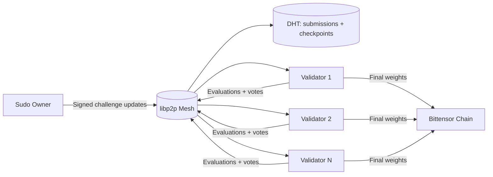
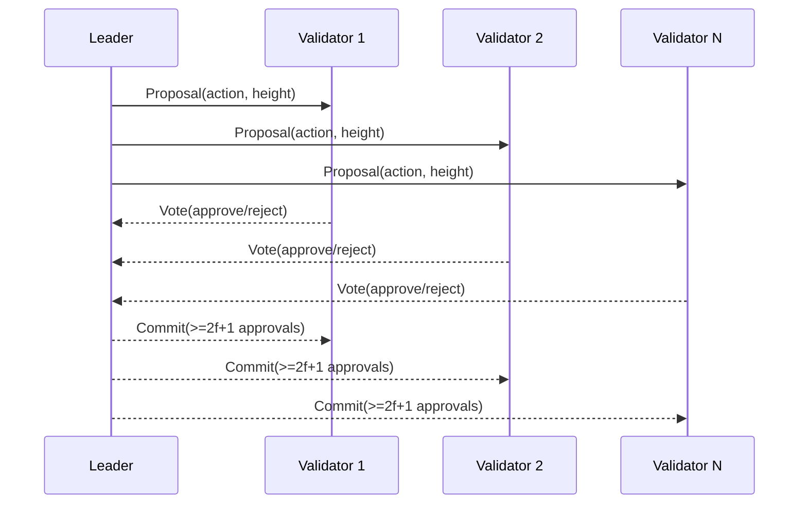
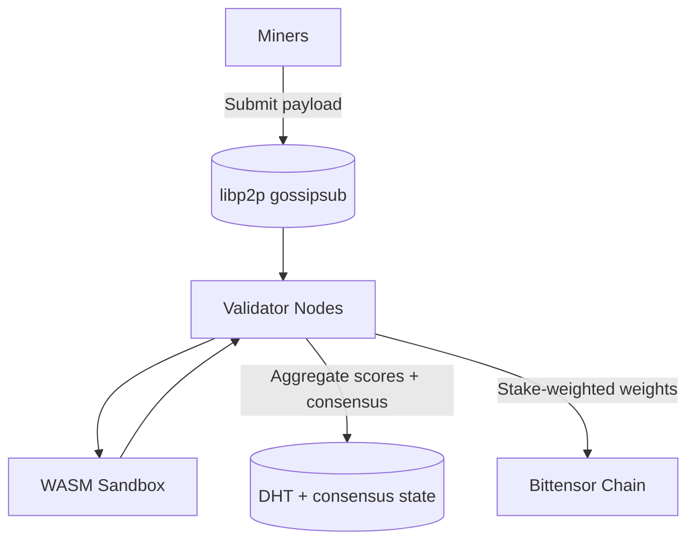
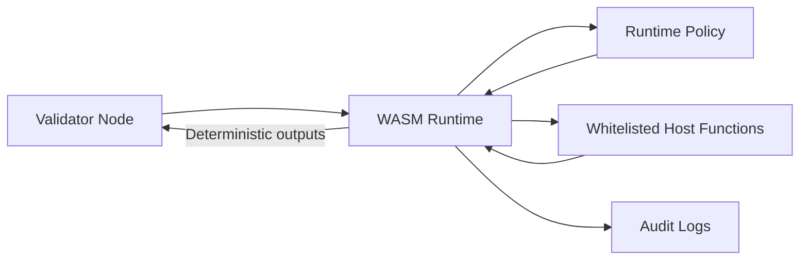

# Architecture

Platform is a **WASM-only, P2P validator network** for deterministic challenge evaluation on Bittensor. Validators exchange submissions, evaluations, and consensus votes directly over libp2p, then submit finalized weight matrices to the chain.

## Core Components

- **Validator Node (`validator-node`)**: P2P networking, consensus, evaluation, and weight submission.
- **Challenge Registry**: signed metadata for active challenges (WASM modules + runtime policies).
- **WASM Runtime Interface**: sandboxed execution with resource caps and audited host functions.
- **P2P Consensus Engine**: PBFT-style voting with stake-weighted validator set.
- **Distributed Storage (DHT)**: shared submissions, checkpoints, and consensus state.

## System Context

## Consensus Flow (PBFT-style)

## Data Flow

## Runtime Policy Boundary

## Operational Boundaries

- **WASM-only**: challenge execution runs in WASM.
- **Consensus-driven changes**: challenge lifecycle events require PBFT approvals.

## Storage Model

- **DHT entries**: submissions, evaluation results, consensus checkpoints.
- **Local persistence**: validator state and audit logs under `data/`.

## Related Documentation

- [Security Model](security.md)
- [Challenges](challenges.md)
- [Challenge Integration Guide](challenge-integration.md)
- [Validator Operations](operations/validator.md)
