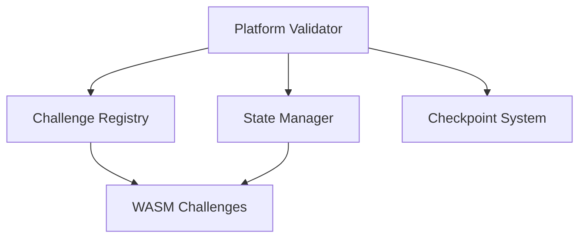
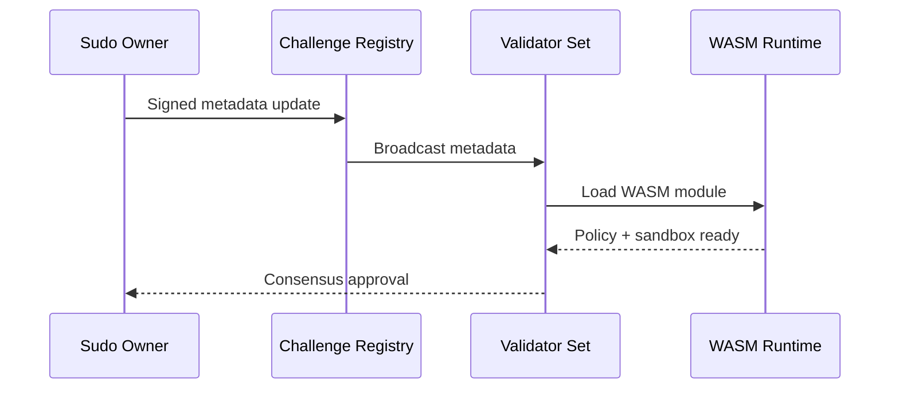

# Challenge Integration Guide

This guide explains how to integrate challenge crates with the Platform validator network. Execution is **WASM-only**.

## Overview

Platform uses a modular challenge architecture where each challenge:

- Runs in a sandboxed WASM runtime (production).
- Communicates with validators via HTTP or WebSocket.
- Persists state through the shared checkpoint system.
- Supports hot-reload without losing evaluation progress.

Challenge outputs feed directly into validator consensus. Validators exchange scores and weight commitments exclusively over libp2p with no centralized relays.

## Integration Architecture



## Challenge Lifecycle in Consensus



## P2P Consensus Inputs

Validators evaluate challenges locally and publish weight commitments over the P2P mesh. Each validator’s voting power is proportional to its Bittensor stake.

1. **Stake-weighted validator set** derived from the metagraph.
2. **Commit phase**: broadcast commitments for weight vectors.
3. **Reveal phase**: reveal weight vectors matching commitments.
4. **Epoch aggregation**: stake-weighted sum yields canonical weights.
5. **Consensus finalization**: validators agree on the aggregated weights and state hash.

## Weight Aggregation at Epoch Boundaries

At each epoch boundary, validators aggregate revealed weights with stake weighting to produce the canonical weight matrix and deterministic state hash. Late or mismatched reveals are rejected to keep aggregation deterministic. The finalized aggregation is the only weight matrix submitted back to Bittensor for the epoch.

## Creating a Challenge Crate

### 1. Project Structure

```
my-challenge/
  Cargo.toml
  src/
    lib.rs           # Challenge implementation
    evaluation.rs    # Evaluation logic
    scoring.rs       # Scoring algorithm
  README.md          # Documentation
```

### 2. Dependencies

Add Platform SDK to your `Cargo.toml`:

```toml
[dependencies]
platform-challenge-sdk = { git = "https://github.com/PlatformNetwork/platform" }
```

### 3. Implement the Challenge Trait

```rust
use platform_challenge_sdk::prelude::*;

pub struct MyChallenge {
    // Your challenge state
}

#[async_trait]
impl ServerChallenge for MyChallenge {
    fn challenge_id(&self) -> &str {
        "my-challenge"
    }

    fn name(&self) -> &str {
        "My Challenge"
    }

    fn version(&self) -> &str {
        env!("CARGO_PKG_VERSION")
    }

    async fn evaluate(
        &self,
        req: EvaluationRequest,
    ) -> Result<EvaluationResponse, ChallengeError> {
        let score = self.evaluate_submission(&req.data)?;

        Ok(EvaluationResponse::success(
            &req.request_id,
            score,
            json!({"details": "evaluation complete"}),
        ))
    }
}
```

### 4. Build WASM Artifact

Build and optimize your challenge into a `.wasm` module:

```bash
cargo build --release --target wasm32-unknown-unknown
```

## State Persistence

### Checkpoint Integration

Challenges automatically benefit from Platform's checkpoint system:

1. **Periodic checkpoints**: every 5 minutes.
2. **Shutdown checkpoints**: on graceful shutdown.
3. **Crash recovery**: on restart, state is restored.

### Custom State

```rust
use platform_challenge_sdk::database::Database;

impl MyChallenge {
    pub fn save_state(&self, db: &Database) -> Result<()> {
        db.set("my_state_key", &self.state)?;
        Ok(())
    }

    pub fn load_state(&mut self, db: &Database) -> Result<()> {
        if let Some(state) = db.get("my_state_key")? {
            self.state = state;
        }
        Ok(())
    }
}
```

## Hot-Reload Support

### Graceful Shutdown Signal

When receiving SIGTERM, your challenge should:

1. Stop accepting new evaluations.
2. Complete in-progress evaluations.
3. Persist any local state.
4. Exit cleanly.

```rust
tokio::select! {
    _ = tokio::signal::ctrl_c() => {
        info!("Shutting down gracefully...");
        self.save_state(&db)?;
    }
}
```

### Version Compatibility

```rust
#[derive(Serialize, Deserialize)]
struct MyState {
    #[serde(default)]
    version: u32,
}

impl MyState {
    fn migrate(&mut self) {
        if self.version < 2 {
            self.version = 2;
        }
    }
}
```

## Health Checks

Implement health check endpoints:

- `GET /health` - Returns 200 if healthy.
- `GET /ready` - Returns 200 if ready for traffic.
- `GET /live` - Returns 200 if process is alive.

## Registration

### Local Development

Add to workspace `Cargo.toml`:

```toml
[workspace]
members = [
    "challenges/my-challenge",
]
```

### Production Deployment

1. Build the WASM challenge artifact.
2. Register via sudo action (network operator only).
3. Validators load the WASM runtime without Docker.

## Best Practices

1. **Deterministic evaluation**: same input produces same output.
2. **Resource-aware design**: keep runtime usage within policy limits.
3. **Versioned outputs**: include version in responses for auditability.
4. **Clear scoring**: document scoring and mapping of outputs to weights.

## References

- [Challenges](challenges.md)
- [Security Model](security.md)
- [Architecture](architecture.md)
