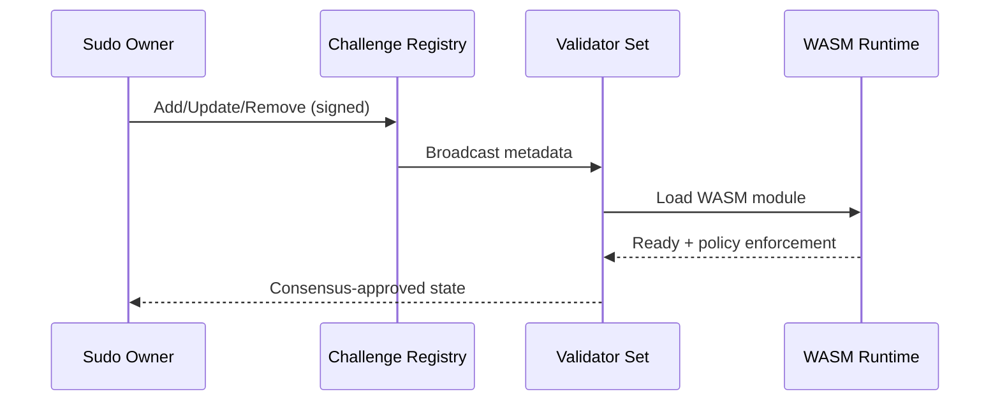
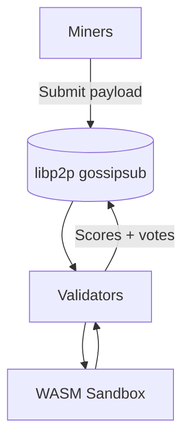
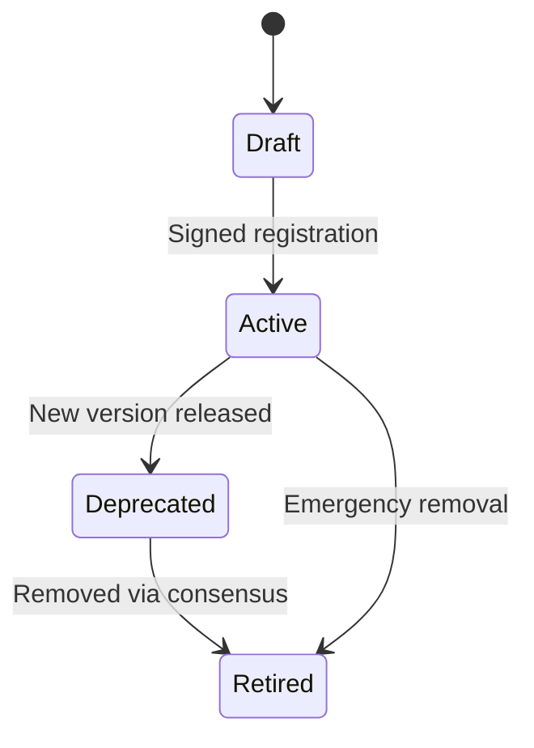

# Challenges

Challenges define the evaluation logic for miners. Platform treats challenges as **WASM modules** with deterministic execution, explicit resource limits, and signed metadata distributed over the validator network.

## Challenge Lifecycle

## Challenge Execution Flow

## Runtime Constraints

- CPU, memory, and I/O quotas enforced per evaluation.
- Network access allowed only via explicit policy.
- Deterministic execution required for consensus reproducibility.

## Challenge Metadata

Each metadata bundle includes:

- Challenge identifier + version.
- WASM module hash and entrypoint.
- Resource policy (CPU/memory/time limits).
- Network policy (allowed domains/IPs).
- Scoring configuration and mechanism mapping.

## Challenge States

## References

- [Challenge Integration Guide](challenge-integration.md)
- [Security Model](security.md)
- [Architecture](architecture.md)
