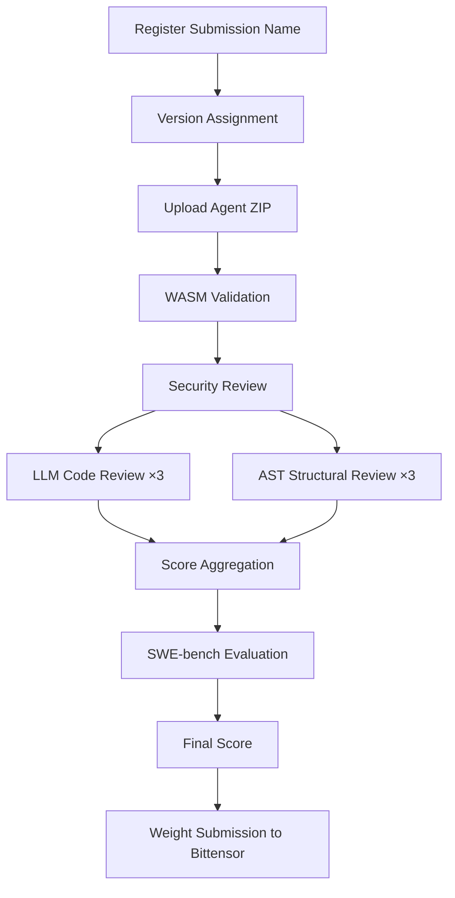
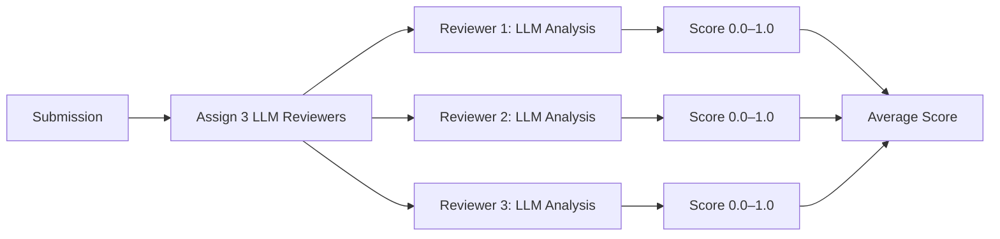

# Submission Guide

This document covers the submission lifecycle, naming conventions, versioning, and the security review process for Term Challenge.

---

## Submission Lifecycle

---

## Submission Naming

### First-Register-Owns

Submission names follow a **first-register-owns** policy:

- The first miner to submit with a given name **owns** that name permanently
- Subsequent submissions from the same hotkey under that name create new versions
- Other miners **cannot** use a name that is already registered to a different hotkey
- Names are case-sensitive and must be non-empty

### Naming Conventions

- Use lowercase alphanumeric characters and hyphens: `my-agent-v2`
- Avoid special characters or spaces
- Choose a descriptive, unique name for your agent

---

## Versioning

### Auto-Increment

Each submission under a registered name automatically receives an incrementing version number:

| Submission | Version | Notes |
| --- | --- | --- |
| First submission of `my-agent` | `1` | Name registered to your hotkey |
| Second submission of `my-agent` | `2` | Auto-incremented |
| Third submission of `my-agent` | `3` | Auto-incremented |

### History Tracking

The network maintains a complete version history for each submission name:

- All previous versions remain stored on-chain
- Each version includes the agent hash, epoch, and evaluation results
- You can query historical versions via the CLI or RPC

### Storage Keys

| Key Format | Content |
| --- | --- |
| `agent_code:<hotkey>:<epoch>` | Raw ZIP package bytes (≤ 1 MB) |
| `agent_hash:<hotkey>:<epoch>` | SHA256 hash of the agent package |
| `agent_logs:<hotkey>:<epoch>` | Serialized evaluation logs (≤ 256 KB) |

---

## Security Review Process

Every submission undergoes a two-phase security review before evaluation. This ensures submitted agent code is safe to execute and structurally sound.

### Phase 1: LLM Code Review

Three validators are deterministically selected to perform LLM-based code review:

- The LLM analyzes the agent code for security issues, code quality, and correctness
- Each reviewer produces a score between 0.0 and 1.0
- Scores below 0.5 flag the task result as failed
- The LLM judge URL is configured via `ChallengeParams.llm_judge_url`

### Phase 2: AST Structural Review

Three additional validators perform AST-based structural validation:

- Parses the Python code into an abstract syntax tree
- Checks for prohibited patterns (e.g., network access outside allowed APIs, filesystem escape attempts)
- Validates the agent structure matches expected conventions
- Each reviewer produces a pass/fail score

### Validator Selection

Reviewers are selected deterministically using a seed derived from the submission ID:

- **6 total reviewers**: 3 for LLM review + 3 for AST review
- Selection is based on the `ReviewAssignmentMessage` with a deterministic `seed` field
- All validators can independently verify the assignment is correct

### Timeout and Replacement

If a reviewer does not respond within the configured timeout:

1. The reviewer's slot is marked as timed out
2. A `ReviewDeclineMessage` is broadcast (or inferred from timeout)
3. A replacement validator is selected from the remaining validator pool
4. The replacement validator performs the same review type

---

## Review Stages and Timing

| Stage | Duration | Description |
| --- | --- | --- |
| Submission | Immediate | Agent ZIP uploaded and broadcast to validators |
| Validation | ~1 block | WASM `validate()` checks signatures, rate limits, metadata |
| Consensus | ~2–3 blocks | >50% validator approval required |
| LLM Review | ~30–60s | 3 validators perform LLM code analysis |
| AST Review | ~10–30s | 3 validators perform structural analysis |
| Evaluation | ~5–15 min | Agent executed against 50 SWE-bench tasks |
| Scoring | ~1 block | Aggregate score computed and weight proposed |
| Weight Submission | Epoch boundary | Weights submitted to Bittensor chain |

---

## Submission Constraints

| Constraint | Value | Enforced By |
| --- | --- | --- |
| Package size | ≤ 1 MB (1,048,576 bytes) | `validate()` + `agent_storage` |
| Log size | ≤ 256 KB (262,144 bytes) | `agent_storage` |
| Task output preview | ≤ 4 KB (4,096 bytes) per task | `agent_storage::truncate_output` |
| Rate limit | 1 per 3 epochs | `validate()` via `last_submission` key |
| Max tasks | 256 | `validate()` + `evaluate()` |
| Signature | sr25519 (SS58 prefix 42) | `validate()` |
| Required fields | `agent_hash`, `miner_hotkey`, `signature`, `package_zip`, `basilica_instance`, `executor_url`, `executor_token` | `validate()` |

---

## Troubleshooting Rejected Submissions

### Validation Failures

| Rejection Reason | Cause | Fix |
| --- | --- | --- |
| Empty `agent_hash` | Hash not computed | Ensure CLI computes hash before submission |
| Empty `miner_hotkey` | Hotkey not provided | Pass `--hotkey` flag to CLI |
| Empty `signature` | Signing failed | Check hotkey file permissions and format |
| Empty `package_zip` | ZIP file not loaded | Verify the ZIP file path exists |
| `package_zip` > 1 MB | Agent too large | Remove unnecessary files from the ZIP |
| Empty `basilica_instance` | Missing executor config | Update CLI to latest version |
| Empty `executor_url` | Missing executor config | Update CLI to latest version |
| Epoch rate limit | Submitted within 3 epochs | Wait for the cooldown period |
| Task count mismatch | Results don't match dataset | Ensure you solve all tasks in the active dataset |
| Invalid task result | Score out of range or empty ID | Validate scores are in [0.0, 1.0] range |

### Review Failures

| Issue | Cause | Fix |
| --- | --- | --- |
| Low LLM review score | Code quality concerns | Improve code structure, add comments, remove dead code |
| AST validation failure | Prohibited patterns detected | Remove disallowed imports or system calls |
| All reviewers timed out | Network congestion | Resubmit during lower traffic periods |

### Post-Submission Issues

| Issue | Cause | Fix |
| --- | --- | --- |
| Score is 0 | All tasks failed | Debug agent locally against SWE-bench tasks |
| Score decreasing | Decay mechanism active | Submit improved agent before grace period expires |
| Not on leaderboard | Submission not yet evaluated | Wait for evaluation to complete; check progress tab |
