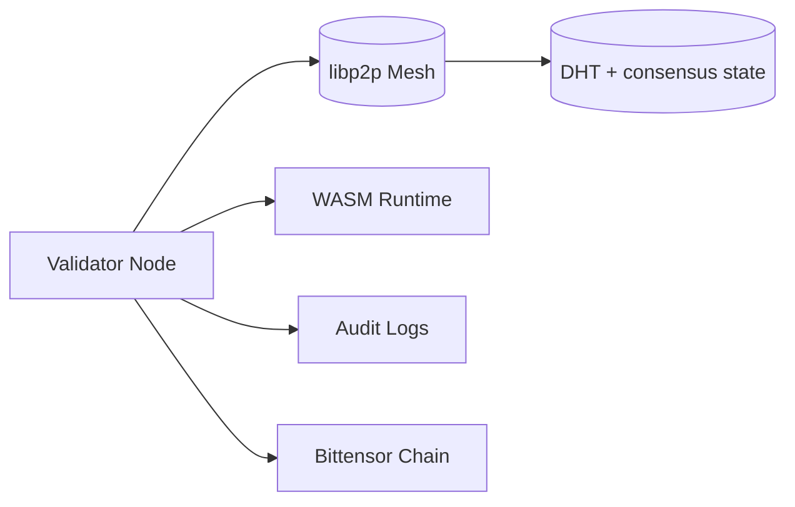
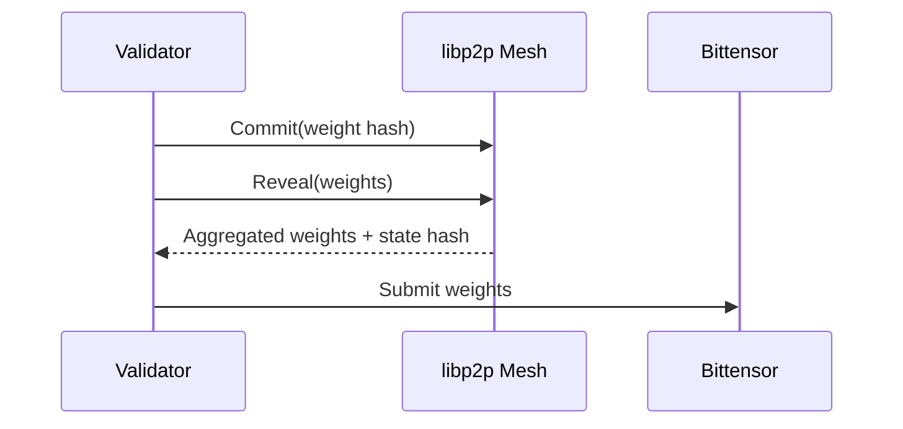

# Validator Operations

This guide covers validator deployment, configuration, monitoring, and lifecycle operations. Validators run directly on host systems with **WASM-first execution**; Docker is used only for integration tests.

## Quick Start

```bash
git clone https://github.com/PlatformNetwork/platform.git
cd platform
cp .env.example .env
# Edit .env: add your VALIDATOR_SECRET_KEY (BIP39 mnemonic)
mkdir -p data
cargo build --release --bin validator-node
./target/release/validator-node --data-dir ./data --secret-key "${VALIDATOR_SECRET_KEY}"
```

## Operational Topology



## Requirements

### Hardware

| Resource | Minimum | Recommended |
| --- | --- | --- |
| CPU | 4 vCPU | 8 vCPU |
| RAM | 16 GB | 32 GB |
| Storage | 250 GB SSD | 500 GB NVMe |
| Network | 100 Mbps | 100 Mbps |

### Network

| Port | Protocol | Usage | Required |
| --- | --- | --- | --- |
| 9000/tcp | libp2p | Validator P2P mesh | Yes |
| 8545/tcp | HTTP | JSON-RPC API | Optional |

### Bittensor

- Minimum stake: 1000 TAO.
- Registered hotkey on subnet.
- BIP39 mnemonic or hex private key.

## Configuration

### Environment Variables

| Variable | Description | Default | Required |
| --- | --- | --- | --- |
| `VALIDATOR_SECRET_KEY` | BIP39 mnemonic or hex private key | - | Yes |
| `SUBTENSOR_ENDPOINT` | Bittensor RPC endpoint | `wss://entrypoint-finney.opentensor.ai:443` | No |
| `NETUID` | Subnet UID | `100` | No |
| `RUST_LOG` | Log level | `info` | No |
| `P2P_LISTEN_ADDR` | libp2p listen address | `/ip4/0.0.0.0/tcp/9000` | No |
| `BOOTSTRAP_PEERS` | Bootstrap peers (comma-separated) | - | Yes |

### Notes

- `BOOTSTRAP_PEERS` is required; validators will refuse to start without peers.
- Secrets should be injected via environment variables or secret managers.

## Consensus & Epoch Timeline



## Monitoring

### Logs

```bash
tail -f ./data/validator.log
```

### JSON-RPC Health Check

```bash
curl -X POST http://localhost:8545/rpc \
  -H "Content-Type: application/json" \
  -d '{"jsonrpc":"2.0","method":"system_health","id":1}'
```

Expected response:

```json
{
  "jsonrpc": "2.0",
  "result": {
    "peers": 5,
    "is_synced": true,
    "block_height": 12345
  },
  "id": 1
}
```

## Operations Playbooks

### Upgrade

```bash
cargo build --release --bin validator-node
./target/release/validator-node --data-dir ./data --secret-key "${VALIDATOR_SECRET_KEY}"
```

### Restart After Divergence

```bash
rm -rf ./data/distributed-db
./target/release/validator-node --data-dir ./data --secret-key "${VALIDATOR_SECRET_KEY}"
```

### Stop

```bash
rm -rf ./data/distributed-db
```

## Testing (Docker Harness Only)

Docker is required only for integration tests. Use the comprehensive test harness if you need Docker-backed evaluation flows:

```bash
./scripts/test-comprehensive.sh
```

## Troubleshooting

### No Peers Connected

- Verify port `9000/tcp` is reachable from the public internet.
- Ensure `BOOTSTRAP_PEERS` lists at least one valid peer multiaddr.

### Bittensor Connection Issues

```bash
curl -I wss://entrypoint-finney.opentensor.ai:443
```

Use an alternative endpoint if needed:

```bash
SUBTENSOR_ENDPOINT=wss://subtensor.api.opentensor.ai:443
```

## Security Best Practices

- Restrict `.env` permissions: `chmod 600 .env`.
- Use a firewall and limit ingress to required ports.
- Rotate keys and monitor logs for anomalies.

## References

- [Architecture](../architecture.md)
- [Security Model](../security.md)
- [Validator Guide](../validator.md)
