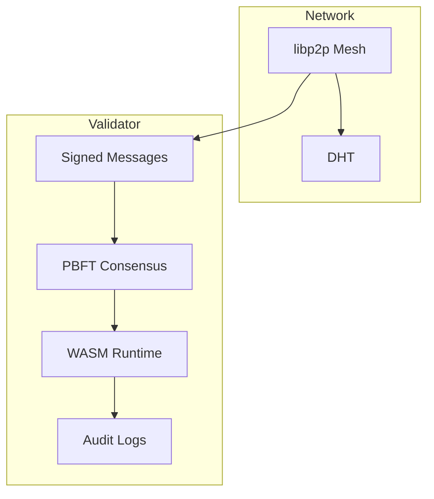
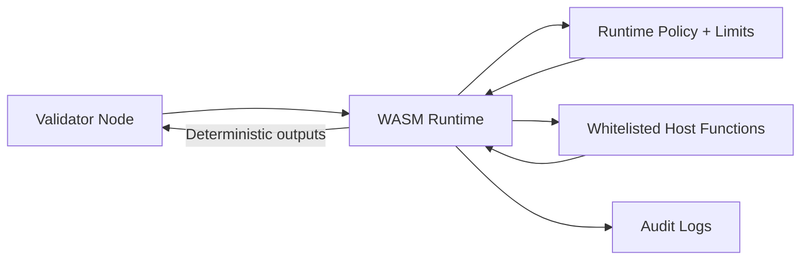

# Security Model

Platform prioritizes deterministic evaluation, validator integrity, and minimal trust assumptions. Security controls are enforced at the network, consensus, and runtime layers.

## Security Pillars

1. **Stake-weighted validator set**: validators must meet minimum stake requirements.
2. **Signed P2P messages**: every submission, evaluation, and vote is signed with the validator hotkey.
3. **PBFT-style consensus**: final state is accepted only with >= 2f + 1 approvals.
4. **WASM sandbox**: challenge execution is isolated with strict runtime policies.
5. **Auditability**: state changes and challenge updates are anchored to chain epochs.

## Threat Model

- **Byzantine validators**: mitigated by quorum thresholds and stake weighting.
- **Sybil attempts**: minimum stake requirements and metagraph verification.
- **Challenge tampering**: challenge metadata is signed and consensus-approved.
- **Resource exhaustion**: WASM runtime enforces CPU, memory, and I/O caps.

## Security Architecture

## Secure Runtime (WASM)

## Security Controls Matrix

| Layer | Control | Outcome |
| --- | --- | --- |
| Identity | Bittensor hotkey signatures | Non-repudiation & replay protection |
| Network | libp2p gossipsub + DHT | Decentralized data propagation |
| Consensus | PBFT-style approvals | Deterministic state finalization |
| Runtime | WASM sandbox + resource caps | Deterministic isolation |
| Operations | Key management + monitoring | Reduced operational risk |

## Operational Controls

- **Key management**: secrets via env vars or secret managers.
- **Network controls**: firewall rules limit ingress to required ports.
- **Monitoring**: health checks and log monitoring detect consensus drift.

## References

- [Architecture](architecture.md)
- [Validator Operations](operations/validator.md)
- [Challenges](challenges.md)
