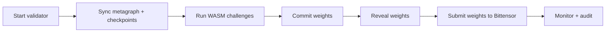
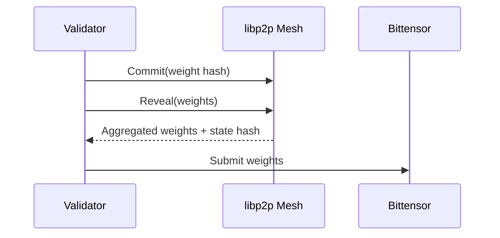

# Validator Guide

This guide explains how to run a Platform validator node on the Bittensor network. Production validators execute challenges in the WASM runtime, while Docker is reserved for integration tests only.

## Key Features

- **No GPU required**: validators run on CPU servers.
- **No third-party APIs**: no external model keys needed.
- **WASM-first runtime**: deterministic challenge execution.
- **P2P-only consensus**: libp2p mesh for all validator traffic.

## Validator Lifecycle



## P2P Architecture

Platform validators run as a fully peer-to-peer network with no centralized fallback services. All validator-to-validator traffic happens over libp2p on port 9000, and consensus data is exchanged directly between peers.

- **Peer discovery**: validators connect to the libp2p mesh and maintain a live peer set.
- **State sync**: checkpoints, block proposals, and commits are shared only through the P2P network.
- **No central coordinator**: there are no HTTP relays or centralized aggregators for consensus.
- **Bittensor anchoring**: the metagraph provides stake and identity, but consensus payloads flow through P2P.

## Weight-Based Consensus Flow

Consensus is driven by validator weights derived from challenge evaluations. The validator set is stake-weighted, meaning higher-stake hotkeys carry more voting power when aggregating challenge results.

1. **Stake-weighted validator set**: each validator’s voting power is proportional to its Bittensor stake in the metagraph.
2. **Challenge evaluation**: validators execute active challenges, producing raw scores.
3. **Commit-reveal weights**: validators commit weight vectors, then reveal them.
4. **Epoch aggregation**: stake-weighted aggregation produces canonical weights.
5. **Consensus agreement**: validators agree on the aggregated weights and state hash.
6. **Weight submission**: finalized weights are submitted back to Bittensor.



## Quick Start

```bash
git clone https://github.com/PlatformNetwork/platform.git
cd platform
cp .env.example .env
# Edit .env: add your VALIDATOR_SECRET_KEY (BIP39 mnemonic)
mkdir -p data
cargo build --release --bin validator-node
./target/release/validator-node --data-dir ./data --secret-key "${VALIDATOR_SECRET_KEY}"
```

## Requirements

### Hardware

| Resource | Minimum | Recommended |
| --- | --- | --- |
| CPU | 4 vCPU | 8 vCPU |
| RAM | 16 GB | 32 GB |
| Storage | 250 GB SSD | 500 GB NVMe |
| Network | 100 Mbps | 100 Mbps |

### Network

**Port 9000/tcp must be open** for P2P communication.

### Software

- Linux (Ubuntu 22.04+ recommended)

### Bittensor

- **Minimum stake**: 1000 TAO.
- Registered hotkey on subnet.
- BIP39 mnemonic or hex private key.

## Configuration Reference

### Environment Variables

| Variable | Description | Default | Required |
| --- | --- | --- | --- |
| `VALIDATOR_SECRET_KEY` | BIP39 mnemonic or hex private key | - | Yes |
| `SUBTENSOR_ENDPOINT` | Bittensor RPC endpoint | `wss://entrypoint-finney.opentensor.ai:443` | No |
| `NETUID` | Subnet UID | `100` | No |
| `RUST_LOG` | Log level (`debug`, `info`, `warn`, `error`) | `info` | No |

### Network Ports

| Port | Protocol | Usage | Required |
| --- | --- | --- | --- |
| 9000/tcp | libp2p | P2P validator communication | Yes |
| 8545/tcp | HTTP | JSON-RPC API | No |

## Monitoring

### Check Validator Status

```bash
# View logs (if running directly)
tail -f ./data/validator.log
```

### JSON-RPC Health Check

```bash
curl -X POST http://localhost:8545/rpc \
  -H "Content-Type: application/json" \
  -d '{"jsonrpc":"2.0","method":"system_health","id":1}'
```

Expected response:

```json
{
  "jsonrpc": "2.0",
  "result": {
    "peers": 5,
    "is_synced": true,
    "block_height": 12345
  },
  "id": 1
}
```

## Docker Policy (Test-Only)

Docker is required only for integration tests. Use `./scripts/test-comprehensive.sh` for Docker-backed evaluation flows.

## References

- [Validator Operations](operations/validator.md)
- [Architecture](architecture.md)
- [Security Model](security.md)
